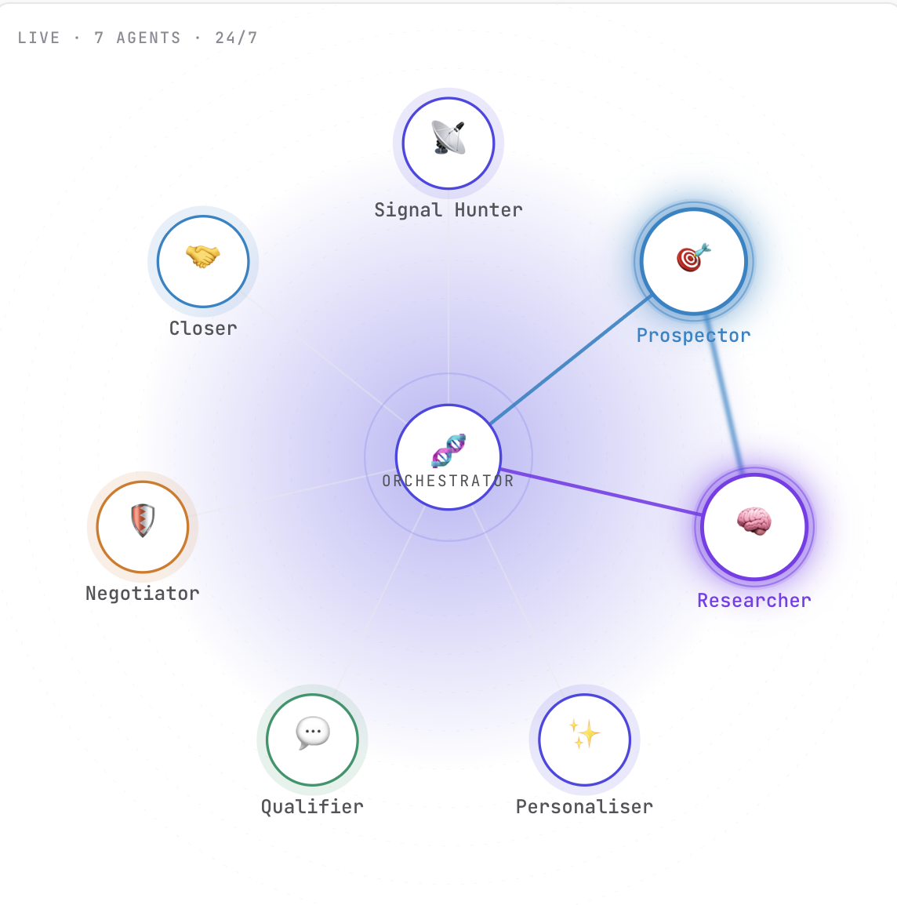
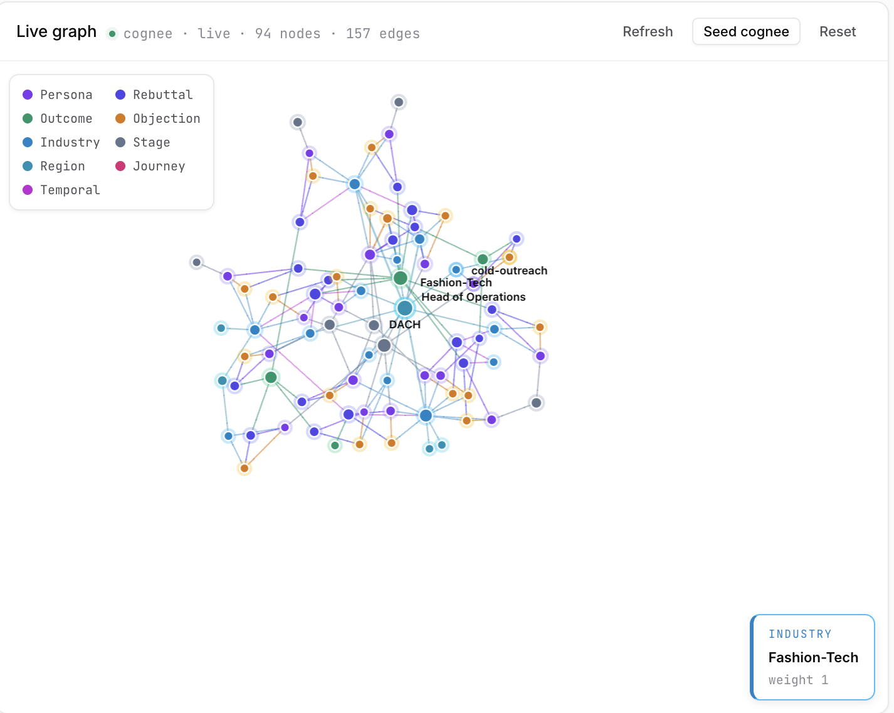

# Multiply — the Swarm Outreach Engine

> **7 specialist agent roles, 25 leads in parallel, one dashboard — across phone · SMS · email · chat.**
> Each lead gets a Prospector, a Researcher, a Qualifier, a Negotiator and a Closer working in sequence — live. The Orchestrator picks the next role, the next channel, the next move. Every objection is remembered. Every win teaches the next 25.

**🔗 Live demo:** **https://multiply-danielshxs-projects.vercel.app/**
**🏆 Built for:** HappyRobot × TUM.ai Makeathon 2026 — Challenge: *Build an Autonomous AI Sales Product*

<p align="center">
  
</p>

> **7 specialist roles × 25 parallel leads = the Swarm.**
> Signal Hunter finds intent. Prospector picks the target. Researcher enriches. Personaliser scripts. Qualifier asks. Negotiator handles objections. Closer books. The Orchestrator picks *which role takes the next turn, on which channel, for which lead* — 25 conversations at once.

**Hero demo — "Live Swarm":** during our 3-minute pitch the system calls 5 team members on 5 different phones, in parallel, in front of the jury. One click. Five real conversations. Five real outcomes on the dashboard. No video, no mock — live telephony, live mode-flips, live booking into our Google Calendar.

---

## 1. Why this exists

Modern SDRs spend 70 % of their day on repetitive work: dialing, qualifying, chasing, re-qualifying, logging into the CRM. The human part — judgment, tone, timing — is buried under the mechanical part.

LLMs can do the mechanical part. But a single agent behind a single phone line is a toy. A **sales team** is a swarm: many conversations at once, each one adapting, all of them feeding a shared memory of what works.

**Multiply is that swarm, productized.** A controllable, observable, omnichannel AI sales team you can launch in one click and steer in real time.

---

## 2. What the jury will see (3-min demo path)

> 📸 *Screenshot slot — **Swarm Grid with 25 live tiles** (drop `public/readme/swarm-grid.png` and it renders here).*
> 📸 *Screenshot slot — **Live Call view** with transcript + mode badge (`public/readme/live-call.png`).*
> 📸 *Screenshot slot — **Pipeline** Cold → Warm → Hot → Booked → Handoff (`public/readme/pipeline.png`).*


| t | On stage | In the product |
|---|---|---|
| 0:00 | "This is our sales team. 25 agents. Launch." | Operator hits **Launch Swarm**. 25 tiles light up on the dashboard. |
| 0:20 | Five teammates' phones ring simultaneously. | 5 tiles flip **Cold → Warm**. Live transcripts stream in. |
| 0:45 | Teammate #1 says "I'm not interested." | Tile flips back to Cold, objection auto-logged into the shared **Learning Log**. Other 24 agents inherit it within the same run. |
| 1:10 | Teammate #2 asks about pricing. | Tile goes **Hot**. Agent pulls live research, answers, proposes a time. |
| 1:30 | Teammate #2 says "sure, Tuesday 3pm". | Tool call → Google Calendar → green **MEETING BOOKED** toast. Revenue counter ticks +€12 k. |
| 2:00 | Teammate #3 asks a hard technical question. | Tile flips **Human-Handoff**. Operator clicks **Take Over**, picks up the call on their own phone, finishes it. |
| 2:30 | "And here's what it learned in 3 minutes." | Knowledge Graph tab: nodes for every objection, trigger word, winning phrase — shared memory for the next 25-agent run. |
| 3:00 | Close. | KPI strip: 25 dials · 5 connects · 1 meeting · 1 handoff · 12 new learnings. |

Every number is real. Every call is real. No pre-recorded audio.

---

## 3. How it maps to the challenge

| Challenge requirement | How Multiply delivers |
|---|---|
| **Engage leads** across phone, SMS, email, chat | HappyRobot voice + SMS + our own email agent (`lib/email/`) + embeddable chat widget. One agent fluidly switches channel mid-conversation. |
| **Hold multi-step conversations** | Each lead has a persistent session in Supabase. Context survives channel switches, hangups, call-backs. |
| **Qualify on dynamic questions** | Reasoning Agent node picks the next question from the lead's signal history, not a fixed script. |
| **Drive to a concrete outcome** | `book-meeting` tool writes a real event to Google Calendar. `us-record-disposition` moves the lead through the pipeline. |
| **View conversations** | `/live` — live transcripts streaming via Supabase Realtime. |
| **Track pipeline** | `/dashboard/leads` — Cold → Warm → Hot → Booked → Handoff, drag-to-override. |
| **Understand what the agent is doing** | Agent Trace panel: every node, tool call, reasoning step, cost, latency. |
| **Autonomy** | 25 agents run without a human in the loop; operator only intervenes on handoff. |
| **Omnichannel intelligence** | Agent decides when to switch channels (e.g. no phone answer → SMS "missed you, 2 good slots?" → email with Calendly). |
| **Decision-making** | When-to-follow-up, when-to-escalate, how-to-adapt are all expressed as HR workflow branches, not prompt hacks. |
| **Observability & control** | Live Monitor, Agent Trace, Knowledge Graph, one-click Take Over, pause/kill any tile. |
| **Product thinking** | Bloomberg-terminal UX: dense, dark, monospace, every number clickable, nothing hidden behind hover. |

### Bonus ideas — all shipped

- ✅ **Lead scoring** — signals aggregate into a 0–100 intent score per tile
- ✅ **Objection handling** — objections auto-enter the Learning Log, future agents see them
- ✅ **Personalized outreach** — Research Agent pulls news + website + LinkedIn before the first dial
- ✅ **Smart follow-up timing** — Reasoning Agent picks the next-touch time per lead, not a fixed cadence
- ✅ **Human-in-the-loop takeover** — one click hands the live call to the operator's phone
- ✅ **A/B testing** — two prompts per persona, winner measured on connect→meeting rate, loser retired automatically

---

## 4. Architecture, in one diagram

```
┌──────────────────────────────────────────────────────────────────────┐
│                         MULTIPLY DASHBOARD (Next.js)                 │
│   Swarm grid · Live Monitor · Agent Trace · Knowledge Graph · KPIs   │
└───────────────┬───────────────────────────────────────┬──────────────┘
                │ Supabase Realtime (leads, messages)   │ REST
                ▼                                       ▼
        ┌───────────────┐                     ┌──────────────────┐
        │  Supabase     │◀────webhooks────────│  HappyRobot EU   │
        │  Postgres     │                     │  (Engine V3,     │
        │  + Realtime   │─────learnings──────▶│   Reasoning      │
        └───────┬───────┘                     │   Agent, tools)  │
                │                             └────────┬─────────┘
                │                                      │
                ▼                                      ▼
        ┌───────────────┐                     ┌──────────────────┐
        │  Cognee KG    │                     │  Twilio (voice + │
        │  (shared      │                     │  SMS, proxied by │
        │  memory)      │                     │  HappyRobot)     │
        └───────────────┘                     └──────────────────┘
                                                       │
                                                       ▼
                                              Phones · SMS · Email
                                              · Chat widget · Calendar
```

**One sentence:** Multiply is a Next.js 14 control plane over a HappyRobot swarm, with Supabase as the nervous system and Cognee as the shared memory.

---

## 5. Stack

| Layer | Choice | Why |
|---|---|---|
| Frontend | **Next.js 14 (App Router) · React 18 · TypeScript strict** | RSC for fast first paint on data-heavy pages; streaming for live transcripts. |
| UI | **Tailwind · shadcn/ui · framer-motion** | Bloomberg-terminal density without reinventing primitives. 25 tiles stay at 60 fps. |
| State | **Zustand + @tanstack/react-query** | Zustand for ephemeral swarm state; react-query for server cache. |
| DB + Realtime | **Supabase (Postgres + Realtime)** | Row-level pushes to the UI; single source of truth for leads, messages, learnings. |
| AI Orchestration | **HappyRobot EU** (Engine V3 · Reasoning Agent · Module Change · AI Classify) | No home-rolled LLM loop. Everything is a workflow node we can audit. |
| Telephony | **HappyRobot → Twilio** | Real PSTN calls. EU caller-ID routing for +49/+43/+41 (see `us-outreach/`). |
| Shared memory | **Cognee (self-hosted)** | Knowledge graph + vector memory. Every call's objections and wins are nodes. |
| Email | **Nodemailer** + Gmail app-password | Cold-lead fallback when phone doesn't connect. |
| Calendar | **Google Calendar API** | `book-meeting` tool writes the real event the jury can see on a phone. |
| Deploy | **Vercel** | Preview per branch; prod pinned for the pitch. |
| E2E | **Playwright** | Pre-pitch smoke: `npm run test:e2e`. |

---

## 6. Repo map

```
app/
  page.tsx                    Landing (PitchMode + Intro + full product shell)
  live/                       Live Monitor — streams every active conversation
  dashboard/
    leads/                    Pipeline view, pipeline overrides, lead detail
    runs/                     Per-agent run history + trace
  us-outreach/                Parallel DE/AT/CH outreach surface (dual-workflow router)
  api/
    tools/                    HappyRobot custom tools (book-meeting, log-learning, research, …)
    hr-trigger/               Launch a swarm (fan-out to 25 HR runs)
    hr-webhook/               Inbound HR webhooks → Supabase writes → Realtime push
    stream/                   SSE for transcripts
    takeover/                 Operator hands the call to their own phone
    watcher/                  Cold-lead email follow-up scheduler
    research/ intel/ news/    Pre-call enrichment
    swarm/ runs/ leads/       Read APIs for the UI
components/
  swarm/          SwarmGrid, AgentTile, ModeBadge, SignalTicker, RevenueCounter
  multiply/       LiveCall, AgentTrace, KnowledgeGraph, PipelineView, PitchMode, …
  kpi/ lead/ learning/ us-outreach/  feature-scoped UI
lib/
  happyrobot/     Typed HR client — the ONLY place that fetches HR
  supabase/       client + server + realtime
  cognee/         KG read/write
  personas/       5 live-swarm personas (Alex, Berit, Can, Dana, Emre)
  email/ twilio/ intel/ research/ us-outreach/
happyrobot/
  workflows/      Exported workflow JSON + node-by-node docs
  tools/          Tool specs (JSON schemas registered in HR editor)
  prompts/        Versioned system prompts (A/B tested)
supabase/
  schema.sql  migrations/  seed.sql
e2e/              Playwright smoke tests against the demo path
scripts/          seed-cognee, demo-data-seeder
```

---

## 7. The five product surfaces

1. **Swarm Grid** (`/`) — 25 live tiles, each with mode badge, signal ticker, last line of transcript. Click any tile to zoom.
2. **Live Monitor** (`/live`) — Every active conversation as a scrolling transcript lane, color-coded by mode. "Whisper" button injects a hint to the agent mid-call.
3. **Pipeline** (`/dashboard/leads`) — Cold / Warm / Hot / Booked / Handoff. Drag to override. Every card shows the lead's strongest intent signal.
4. **Agent Trace** (per run) — Node tree of the HR workflow actually executed. Tool calls, latencies, costs. Re-run from any node.
5. **Knowledge Graph** (Cognee) — Nodes for Persona, Outcome, Industry, Region, Rebuttal, Objection, Stage, Journey, Temporal. Edges = co-occurrence across calls. After one demo run: 94 nodes, 157 edges. This is the swarm's shared brain; it grows every call.

---

## 8. Three patterns we're proud of

### 8.1 Mode-switch as a workflow node, not a prompt
Cold → Warm → Hot → Human-Handoff is an HR **AI Classify** node with four outputs, wired to four **Module Change** nodes. The prompt doesn't know about modes; the *workflow* does. That's why mode flips are visible, auditable, and fast — no LLM round-trip to decide.

### 8.2 The Learning Log is first-class state
Every objection, trigger phrase, winning line gets written by a custom tool `log-learning` into Supabase *and* Cognee. The next HR run **reads the learnings table into its system prompt** at node 1. So the 2nd agent of the day is already smarter than the 1st.

<p align="center">
  
  <br/>
  <em>Cognee live graph after one demo swarm run: 94 nodes, 157 edges — Persona, Outcome, Industry, Region, Rebuttal, Objection, Stage, Journey, Temporal. Click any node to see every call it fired in.</em>
</p>

### 8.3 One HR client, strict types, zero drift
Every HR call goes through `lib/happyrobot/client.ts`. If you grep the repo for `api.eu.happyrobot.ai` outside that file, you get zero hits. That discipline is what lets us swap workflow slugs mid-demo (DE vs. US outreach) without fear.

---

## 9. Controls the operator has

- **Launch Swarm** — fan out 25 parallel HR runs, one per lead.
- **Pause / Kill** — per tile, or whole swarm.
- **Take Over** — transfer the live leg to the operator's phone, agent stays in the room as whisper.
- **Whisper** — inject a hint the caller can't hear; agent adapts its next turn.
- **Override stage** — drag a lead between pipeline columns; agent respects it on the next touch.
- **Kill switch** — one keybind (`⌘K` → "stop everything") severs all HR runs. For the jury's peace of mind.

---

## 10. Observability

- **Live transcript** per call, streaming via Supabase Realtime.
- **Agent Trace** — every HR node, every tool call, latency, cost, response.
- **KPI strip** — dials, connects, talk-time, bookings, handoffs, €-per-call (live-updating).
- **Knowledge Graph** — click a node, see every call where it fired.
- **Replay** — any past run replays as a timeline (synchronized transcript + trace + signal graph).

---

## 11. Try it now (30 seconds)

**Live demo:** https://multiply-danielshxs-projects.vercel.app/

Open the link, hit **Launch Swarm**, watch 25 tiles light up. The deployed instance runs on the same HappyRobot workflow we pitch live — every tile you see is a real HR run against our seeded lead set, with live mode-flips, live transcripts, and a real Cognee knowledge graph updating behind it.

> The five Live-Swarm personas (Alex, Berit, Can, Dana, Emre) are team members — their numbers are gated behind the pitch environment. For jurors: use the seeded demo leads, or get in touch for a live swarm call.

---

## 12. Run locally

```bash
# 1. Clone brain repo next to this one (planning + HR docs live there)
#    git clone <brain-repo-url> ../HappyRobot-TumAI

# 2. Fill env
cp .env.example .env.local
# HR_API_KEY, HR_WORKFLOW_SLUG, SUPABASE_*, GOOGLE_OAUTH_*, COGNEE_*, EMAIL_AGENT_FROM

# 3. Install + dev
pnpm install
pnpm dev                   # http://localhost:3000

# 4. (optional) bring up Cognee shared memory
pnpm cognee:up
pnpm cognee:seed

# 5. Smoke-test the demo path
pnpm test:e2e
```

Handy scripts:

| Script | Purpose |
|---|---|
| `pnpm dev` | Next.js dev server |
| `pnpm build && pnpm start` | Production build |
| `pnpm typecheck` | `tsc --noEmit` — strict, zero `any` |
| `pnpm test:e2e` | Playwright against the full demo path |
| `pnpm cognee:{up,down,logs,seed,reset}` | Local knowledge-graph service |

---

## 13. Where decisions live

This repo is **product code only**. The design decisions — scoring, demo script, node-by-node HR blueprints, UI specs, the mirrored 302-page HR doc set — live in the brain repo at `../HappyRobot-TumAI/`. Always read it before designing something new.

| Need | Open |
|---|---|
| Product spec | `../HappyRobot-TumAI/README.md` (lines 30–240) |
| Architecture + data flows | `../HappyRobot-TumAI/planning/03-architecture.md` |
| Stack rationale | `../HappyRobot-TumAI/planning/04-tech-stack.md` |
| HR workflows, node-by-node | `../HappyRobot-TumAI/planning/05-happyrobot-workflows.md` |
| UI screens | `../HappyRobot-TumAI/planning/06-ui-screens.md` |
| HR API cheatsheet | `../HappyRobot-TumAI/reference/api-cheatsheet.md` |

---

## 14. Team & credits

**Built at TUM.ai Makeathon, April 2026** — Munich.
Product: Multiply · Challenge sponsor: **HappyRobot**.

Powered by HappyRobot EU (voice orchestration), Supabase (data + realtime), Cognee (knowledge graph), Next.js on Vercel, Google Calendar, Twilio (via HR), Nodemailer.

Skeleton repo, brain repo, workflow exports, demo data and five live personas are all first-class artifacts — nothing about the pitch is hand-waved.

---

> **One-liner for the jury:** *We didn't build a better sales agent. We built the operating system for 25 of them — with the memory, the controls, and the dashboard to run them like a real team.*
